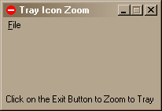



## Tray Module

### Description

This program will show API Calls to Zoom your form to/from the screen to the Icon Tray. Also, it will show you how to interrupt the user from exiting the program with the control box. If you have any thing to add or if you want to change it into a control, feel free. Most code is adapted from snippits I have found throughout the years.
 
### More Info
 

             |
---                |---
**Submitted On**   |2001-04-12 20:14:22
**By**             |[JungleSpank](https://github.com/Planet-Source-Code/PSCIndex/blob/master/ByAuthor/junglespank.md)
**Level**          |Advanced
**User Rating**    |5.0 (15 globes from 3 users)
**Compatibility**  |VB 4\.0 \(32\-bit\), VB 5\.0, VB 6\.0
**Category**       |[Windows API Call/ Explanation](https://github.com/Planet-Source-Code/PSCIndex/blob/master/ByCategory/windows-api-call-explanation__1-39.md)
**World**          |[Visual Basic](https://github.com/Planet-Source-Code/PSCIndex/blob/master/ByWorld/visual-basic.md)
**Archive File**   |[Tray Modul182984122001\.zip](https://github.com/Planet-Source-Code/junglespank-tray-module__1-22367/archive/master.zip)

